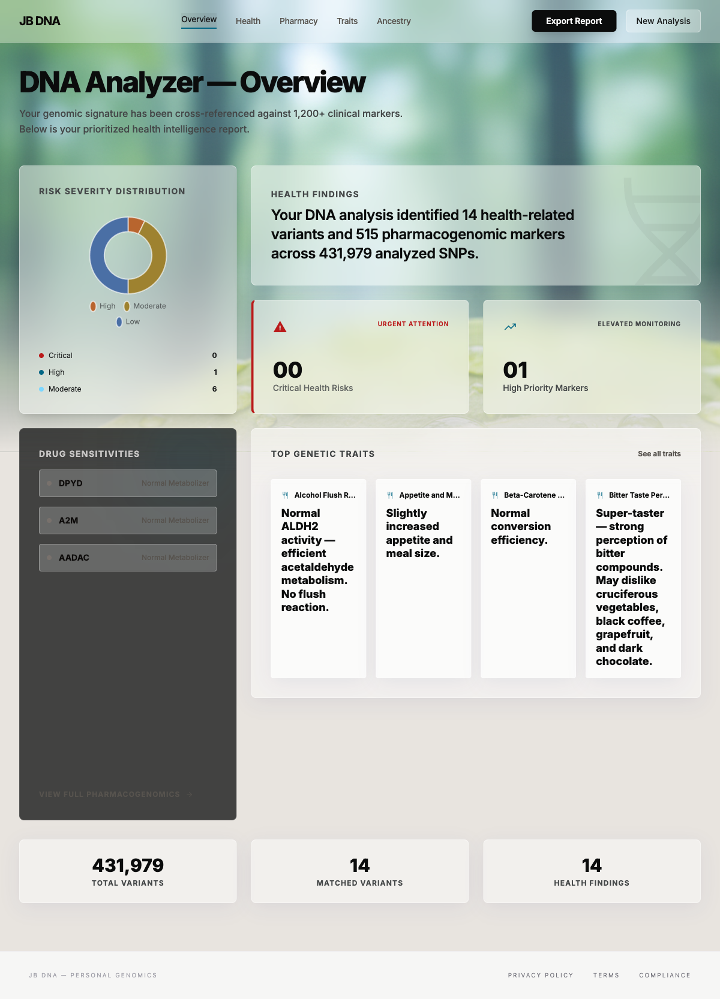

# JB DNA (dna-analyzer)

**A Flask web app that takes a raw AncestryDNA file, cross-references it against several authoritative public genomic databases, and produces a structured health / pharmacogenomics / ancestry report — now enriched with sequence-based regulatory predictions from Google DeepMind's AlphaGenome, and with privacy-by-design (raw files are parsed in memory and never written to disk).**



The project exists to answer a simple question: what can you actually learn from your AncestryDNA raw data file beyond what the consumer report tells you? The answer turns out to be a lot — but only if you're willing to integrate a handful of authoritative, regularly-updated reference databases and normalise them into a single coherent schema.

## What it does

Upload a raw AncestryDNA file and the analyzer produces:

- **Clinical variant findings** — cross-referenced against ClinVar (NCBI) for pathogenic / likely-pathogenic variants
- **Polygenic risk scores** — computed from GWAS Catalog (EBI) summary statistics across common complex traits
- **Pharmacogenomic response** — drug metabolism and response predictions from PharmGKB clinical annotations
- **Ancestry haplogroups** — mtDNA and Y-chromosome lineage placement from curated haplogroup trees
- **Trait predictions** — physical traits (eye colour, lactose tolerance, etc.) from curated trait-variant tables
- **Disease prevalence context** — population-level baselines so findings can be interpreted in context
- **Predicted regulatory impact** — for each variant, a sequence-based prediction (from Google DeepMind's **AlphaGenome**) of how it affects nearby gene expression / accessibility / splicing, including the tissue most affected — pre-computed offline and surfaced on health and trait findings

## Privacy-by-design

`app.py` reads uploaded files entirely into memory via `io.StringIO` and never writes them to disk. The only persistent state is the local SQLite reference database (public data, built by `setup_database.py`). This is a deliberate trade-off — it means no file caching, no resumable uploads — but raw genetic data never touches the filesystem, full stop.

## Architecture

```
dna-analyzer/
├── app.py                        # Flask: upload endpoint, in-memory parsing, JSON responses
├── setup_database.py             # Downloads ClinVar / GWAS / PharmGKB + builds local SQLite
├── config.py                     # DB paths, source URLs, thresholds (GWAS p-value, etc.)
├── requirements.txt              # Flask, pandas, scipy, requests
├── analyzers/
│   ├── parser.py                 # AncestryDNA raw-data parser (rsid, chromosome, position, genotype)
│   ├── ancestry.py               # Haplogroup placement (mtDNA + Y-chromosome)
│   ├── health_risks.py           # ClinVar cross-reference
│   ├── polygenic_risk.py         # GWAS Catalog → PRS computation
│   ├── risk_calculator.py        # Statistical helpers (odds ratios, effect sizes)
│   ├── pharmacogenomics.py       # PharmGKB clinical annotation lookup
│   ├── traits.py                 # Trait variant lookup
│   ├── alphagenome_scores.py     # Loads pre-computed AlphaGenome regulatory summaries
│   └── report_generator.py       # Aggregate analyzers → single JSON report
├── scripts/                      # Build-time enrichment (Google DeepMind science-skills)
│   ├── validate_health_variants.py   # Validate curated data vs live ClinVar/gnomAD/dbSNP
│   ├── apply_validation_fixes.py     # Apply reviewed corrections + provenance
│   ├── resolve_frequency_queue.py    # Resolve flagged frequency-orientation cases
│   └── alphagenome_score_curated.py  # Offline AlphaGenome scoring of curated variants
├── data/
│   ├── curated/                  # Small, authored reference data (committed)
│   │   ├── ancestry_markers.json
│   │   ├── disease_prevalence.json
│   │   ├── haplogroup_tree.json
│   │   ├── health_variants.json
│   │   ├── pharma_variants.json
│   │   ├── prs_definitions.json
│   │   ├── trait_variants.json
│   │   └── alphagenome_scores.json   # Pre-computed regulatory summaries (488 variants)
│   ├── validation/              # Reference-validation reports (build-time output)
│   ├── downloads/                # Raw downloaded data (gitignored, regenerated by setup script)
│   └── reference.db              # Built SQLite (gitignored, ~658 MB)
├── templates/                    # Flask templates (upload form, report view)
└── static/                       # CSS / JS
```

## The reference database

`setup_database.py` is the heart of the data-integration work. It downloads and normalises four heterogeneous sources into a single SQLite database:

| Source | Format | Purpose |
|---|---|---|
| **ClinVar** (NCBI) | TSV, gzipped, ~435 MB | Clinical significance of known variants |
| **GWAS Catalog** (EBI) | TSV inside ZIP, ~540 MB uncompressed | Genome-wide association study hits for complex traits |
| **PharmGKB** | Clinical annotations ZIP | Drug-gene interactions |
| **Curated JSON** (in repo) | Small JSON files | Haplogroup tree, trait variants, disease prevalence baselines |

The first three are large and public — they live in `data/downloads/` and are regenerated by the setup script rather than committed. The curated JSON is small, hand-authored, and ships with the repo.

Schema normalisation across the three TSV sources is non-trivial: different chromosome naming conventions, different reference assemblies (GRCh37 vs GRCh38), different effect-size encodings, and different p-value representations. `setup_database.py` handles these per-source and produces a unified table the analyzers can query by `rsid`.

## Build-time validation & regulatory enrichment

The `scripts/` directory uses Google DeepMind's open-source [**science-skills**](https://github.com/google-deepmind/science-skills) (run via `uv`) to validate and enrich the curated reference data. These run **at build/curation time only** — they query *public reference variants by rsID*, never user genotypes — so the app's offline/privacy guarantee is unchanged. The app reads only the resulting local files at runtime.

- **Reference validation** (`validate_health_variants.py`) cross-checks every curated health variant against live **ClinVar**, **gnomAD** and **dbSNP**: confirming current pathogenicity classifications, attaching real population allele frequencies (allele-pinned and rsID-confirmed, with reverse-complement handling for minus-strand genes), and flagging drift. This caught and fixed a benign variant mislabeled CRITICAL and a protective variant mislabeled pathogenic, and added a `clinvar_xref` provenance field to each entry.
- **Regulatory pre-compute** (`alphagenome_score_curated.py`) scores each curated SNV through **AlphaGenome**, aggregating thousands of per-track predictions into a compact per-variant summary (top affected gene + tissue, own-gene effect, per-modality magnitude) saved to `data/curated/alphagenome_scores.json`. 488 variants are scored; 81% of gene-annotated variants show a significant predicted effect on their own gene (e.g. APOE→neuron, HBB→smooth muscle, ADIPOQ→adipocyte). The app surfaces this as a *"Predicted regulatory impact"* line on findings.

AlphaGenome requires a free (non-commercial) API key, used only during this offline pre-compute step; see the [AlphaGenome docs](https://deepmind.google.com/science/alphagenome/).

## Tech stack

- **Python 3**
- **Flask** — single-file web app, in-memory upload handling
- **SQLite** — local reference database (no client-server dependency)
- **pandas** — TSV parsing and normalisation for the reference build
- **scipy** — statistical helpers for polygenic risk score computation
- **requests** — fetching source data during setup

No ML models or external APIs **at runtime** — AlphaGenome scoring and reference validation run at *build time* only, and their outputs are baked into local files. Everything the app does at request time runs locally against the SQLite reference and curated JSON. (Build-time enrichment additionally uses Google DeepMind's `science-skills` via `uv`.)

## Current state

**Working**
- AncestryDNA file parser (rsid / chromosome / position / genotype)
- Reference database build pipeline (all four sources)
- ClinVar health-risk cross-reference
- PharmGKB pharmacogenomic lookup
- Haplogroup placement
- Trait variant lookup
- Polygenic risk score skeleton
- Flask web UI with in-memory upload
- Curated health data validated against live ClinVar / gnomAD / dbSNP (with provenance)
- AlphaGenome regulatory predictions pre-computed offline and surfaced on findings

**Rougher edges**
- Polygenic risk score computation needs more sophisticated handling of LD (linkage disequilibrium) for accurate effect-size summation
- `population_frequency` currently does double duty (display + absolute-risk baseline); the risk model should use disease prevalence as the baseline instead
- AlphaGenome scoring covers SNVs only — 14 curated indels (e.g. CFTR F508del, CCR5-Δ32) are not yet scored
- No support for 23andMe or other consumer file formats yet (AncestryDNA only)

**Privacy / disclaimers**
- This is a personal tool, not a clinical product. Every output is reference-database lookup + simple statistics. Nothing here is medical advice.
- DNA files are never persisted — raw uploads exist only in memory for the duration of the request

## Running it

**One-time setup** (downloads ~1.6 GB of reference data and builds the local SQLite DB — takes 20–40 minutes depending on bandwidth):

```bash
python -m venv venv
source venv/bin/activate
pip install -r requirements.txt
python setup_database.py
```

**Run the app**:

```bash
python app.py
# opens Flask on the configured host/port (see config.py)
```

Upload an AncestryDNA raw data file via the web UI and view the generated report.

## Key files to skim

- [`app.py`](app.py) — Flask entry point; shows the in-memory upload contract
- [`setup_database.py`](setup_database.py) — the data-integration pipeline (download → normalise → SQLite)
- [`analyzers/parser.py`](analyzers/parser.py) — AncestryDNA file parser
- [`analyzers/report_generator.py`](analyzers/report_generator.py) — how the individual analyzers are composed into a single report
- [`analyzers/polygenic_risk.py`](analyzers/polygenic_risk.py) — GWAS Catalog → PRS computation
- [`scripts/alphagenome_score_curated.py`](scripts/alphagenome_score_curated.py) — offline AlphaGenome scoring of curated variants (build-time)
- [`scripts/validate_health_variants.py`](scripts/validate_health_variants.py) — reference validation vs live ClinVar/gnomAD/dbSNP
